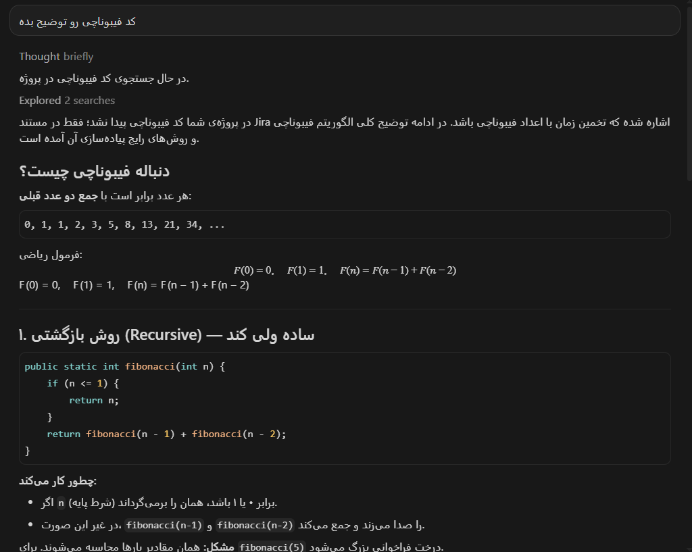
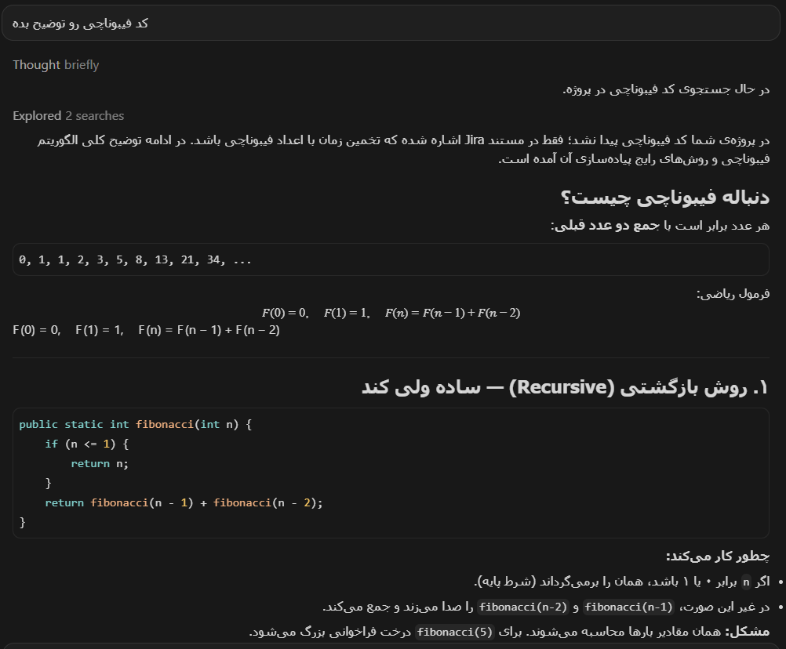

<p align="center">
  
</p>

<p align="center">
  <a href="#english">English</a> | <a href="#فارسی">فارسی</a>
</p>

---

<a id="english"></a>
## English

<p align="center">
  <a href="https://github.com/sadrabarani/persian-rtl-cursor-extension/releases/latest">
    
  </a>
</p>

# Cursor/VSCode RTL Chat Fixer

A fully local extension for smart, automatic right-to-left alignment in the Cursor/VSCode chat panel.

### Before / After

| Before | After |
|---|---|
|  |  |

### What this extension does

The Cursor chat panel is a regular Electron UI that can't be reached through the official extension API (which is limited to an extension's own Webview panels). The only way to inject CSS/JS into that panel is to add one `require` line to the main Electron process's `main.js` — the same approach used by well-known extensions like `vscode-custom-css`.

### RTL detection logic (`rtl-fixer-inject.js`)

For every text block (paragraph, list item, table cell, etc.):

1. Persian/Arabic letters (Unicode range `\u0600-\u06FF` and related blocks) and Latin letters are counted.
2. If the ratio of Persian/Arabic letters is ≥ 30% of all meaningful letters and outnumbers Latin letters → the block becomes `rtl`.
3. `pre`, `code`, and Monaco editor content → always LTR, no exceptions.
4. Tables: the table structure (column order) stays LTR so data order isn't reversed, but each cell's text is independently right- or left-aligned based on its own content.
5. A `MutationObserver` also processes new/streamed messages live.

### Install and use

**Option A — direct download (recommended):**
1. Download the latest `.vsix` from [Releases](https://github.com/sadrabarani/persian-rtl-cursor-extension/releases/latest)
2. In Cursor/VSCode: Extensions panel → `...` menu(or press ctrl+shift+p) → **Install from VSIX...** → select the downloaded file
3. to enable/disable extension you should run cursor as administrator and after enable/disable relaunch app  

**Option B — build from source:**
```bash
cd cursor-rtl-ext
npm install
npm run compile
npx vsce package --baseContentUrl https://github.com/sadrabarani/persian-rtl-cursor-extension/raw/main --baseImagesUrl https://github.com/sadrabarani/persian-rtl-cursor-extension/raw/main
```

Commands (Ctrl+Shift+P):
- **RTL Fixer: Enable RTL Chat**
- **RTL Fixer: Disable and Restore**
- **RTL Fixer: Show Status**
- **RTL Fixer: Reapply After Update**

### Important warning

- This approach is outside the official extension API and may conflict with Cursor's Terms of Service — use at your own risk.
- Every Cursor/VSCode update replaces `main.js`, so you'll need to click "Reapply" again afterward.
- A backup of `main.js` is always made automatically before patching (`main.js.rtl-fixer-backup-<timestamp>`) — to fully restore manually, you can copy this file back over `main.js`.

---

<a id="فارسی"></a>
## فارسی

<p align="center">
  <a href="https://github.com/sadrabarani/persian-rtl-cursor-extension/releases/latest">⬇️ دانلود فایل VSIX از Releases</a>
</p>

# Cursor/VSCode RTL Chat Fixer

افزونه‌ای کاملاً محلی (local-only) برای راست‌چین‌کردن هوشمند و خودکار پنجره‌ی چت در Cursor/VSCode.

### قبل / بعد

| قبل | بعد |
|---|---|
|  |  |

### این افزونه چه می‌کند

پنجره‌ی چت Cursor یک رابط Electron معمولی است که از مکانیزم رسمی افزونه (Webview API محدود به پنل‌های خودِ افزونه) قابل تزریق نیست. به همین دلیل، تنها راه تزریق CSS/JS به آن پنجره، اضافه‌کردن یک خط `require` به فایل `main.js` پروسه‌ی اصلی Electron است — دقیقاً همان روشی که افزونه‌های شناخته‌شده‌ای مثل `vscode-custom-css` هم استفاده می‌کنند.


### منطق تشخیص RTL (`rtl-fixer-inject.js`)

برای هر بلوک متنی (پاراگراف، آیتم لیست، سلول جدول و...):

1. تعداد حروف فارسی/عربی (بازه‌ی یونیکد `\u0600-\u06FF` و مشابه) و حروف لاتین شمارش می‌شود.
2. اگر نسبت حروف فارسی/عربی ≥ ۳۰٪ کل حروف بامعنا باشد و از حروف لاتین بیشتر باشد → بلوک `rtl` می‌شود.
3. بلوک‌های `pre`, `code`, محیط موناکو ادیتور → همیشه LTR، بدون استثنا.
4. جدول‌ها: ساختار جدول (ترتیب ستون‌ها) LTR می‌ماند، اما متن داخل هر سلول به‌صورت مجزا بر اساس محتوایش راست‌چین یا چپ‌چین می‌شود.
5. `MutationObserver` پیام‌های جدید/استریم‌شده را هم به‌صورت زنده پردازش می‌کند.

### نصب و استفاده

**روش الف — دانلود مستقیم (پیشنهادی):**
۱. آخرین فایل `.vsix` رو از [Releases](https://github.com/sadrabarani/persian-rtl-cursor-extension/releases/latest) دانلود کن
۲. در Cursor/VSCode: پنل Extensions ← منوی `...` (ctrl+shift+p) ← **Install from VSIX...** ← فایل دانلود شده رو انتخاب کن
برای فعال سازی یا غیرفعال کردن افزونه باید کرسر را به صورت run as administrator اجرا کنید و یک بار ببندید

**روش ب — بیلد از سورس:**
```bash
cd cursor-rtl-ext
npm install
npm run compile
npx vsce package --baseContentUrl https://github.com/sadrabarani/persian-rtl-cursor-extension/raw/main --baseImagesUrl https://github.com/sadrabarani/persian-rtl-cursor-extension/raw/main
```

دستورات (Ctrl+Shift+P):
- **RTL Fixer: Enable RTL Chat**
- **RTL Fixer: Disable and Restore**
- **RTL Fixer: Show Status**
- **RTL Fixer: Reapply After Update**

### هشدار مهم

- این روش خارج از API رسمی افزونه‌هاست و ممکن است با شرایط استفاده‌ی Cursor در تضاد باشد — مسئولیت استفاده با شماست.
- با هر آپدیت Cursor/VSCode، `main.js` جایگزین می‌شود و باید دوباره «اعمال دوباره» را بزنید.
- همیشه قبل از فعال‌سازی یک بکاپ خودکار از `main.js` گرفته می‌شود (`main.js.rtl-fixer-backup-<timestamp>`) — برای بازگردانی کامل دستی هم می‌توانید این فایل را جای `main.js` کپی کنید.

